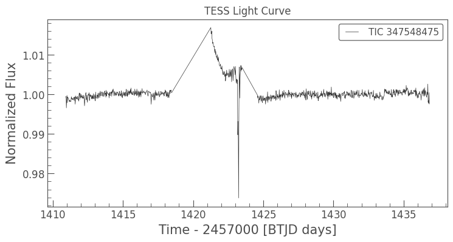
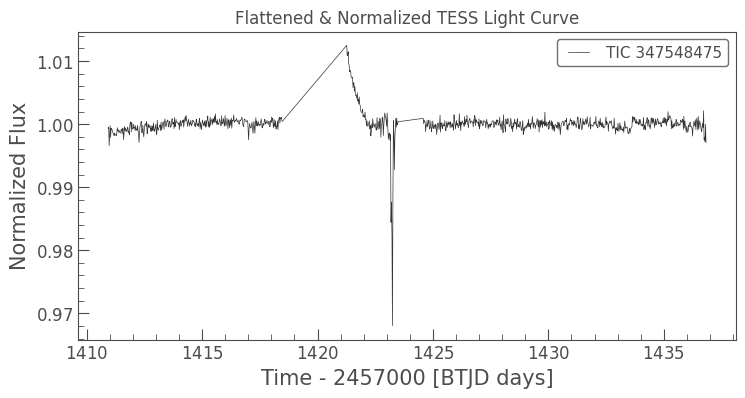
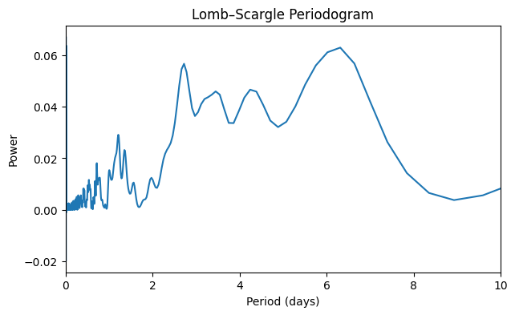
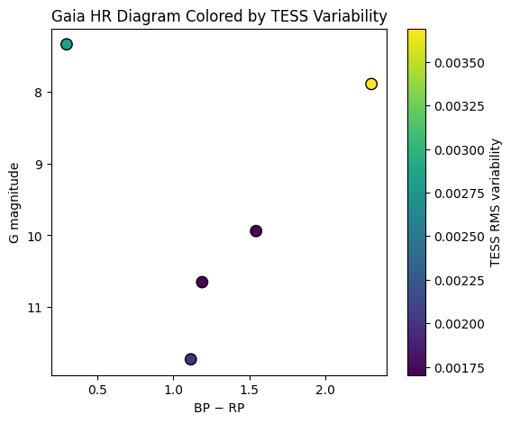

#  Gaia–TESS Variability Detection Pipeline

##  Overview

This repository presents an end-to-end pipeline to study **stellar photometric variability** by combining **Gaia DR3** stellar parameters with **TESS** time-series photometry.

The primary goal is to:
- quantify low-amplitude stellar variability,
- distinguish intrinsic stellar signals from instrumental systematics,
- and assess their impact on **exoplanet detection and confirmation**.

The project is designed as a **pilot cross-survey variability study** and is suitable for extension to larger stellar samples.

---

## Scientific Motivation

Stellar variability is a dominant noise source in transit-based exoplanet surveys.  
While **Gaia** provides precise stellar characterization, **TESS** offers high-cadence photometric monitoring.

By combining both datasets, this pipeline enables:
- detection of low-level variability,
- identification of instrumental artifacts,
- and variability-informed target vetting for exoplanet studies.

---

##  Pipeline Summary

### 1. Gaia DR3 Target Selection
- Minimal synchronous ADQL queries (robust to archive instability)
- Selection of stars with reliable Gaia photometry
- Extracted parameters:
  - `source_id`
  - RA, Dec
  - G-band magnitude
  - BP–RP color

---

### 2. TESS Light Curve Retrieval
- TESS light curves are retrieved using sky coordinates (RA/Dec)
- Implemented using `lightkurve`
- Handles missing TESS coverage gracefully

---

### 3. Light Curve Processing
Each TESS light curve is:
- cleaned of NaN values,
- flattened to remove long-term trends,
- normalized to isolate short-timescale variability.

---

### 4. Variability Quantification
The following metrics are computed:
- **RMS variability** (photometric scatter)
- **Lomb–Scargle periodogram** for dominant periodicities

Periods shorter than ~0.05 days are flagged as **likely instrumental systematics**.

---

##  Results & Outputs

All output figures are saved in the `results/` directory.

### 🔹 Raw TESS Light Curve

**File:** `results/tess_lightcurve_raw.png`

### 🔹 Flattened & Normalized TESS Light Curve

**File:** `results/tess_lightcurve_flattened.png`

### 🔹 Lomb–Scargle Periodogram

**File:** `results/lomb_scargle_periodogram.png`

### 🔹 Gaia HR Diagram Colored by TESS RMS Variability

**File:** `results/hr_diagram_tess_rms.png`

## Output Data Products

- `gaia_tess_variability_final_catalog.csv`  
  - Gaia identifiers and photometry  
  - TESS RMS variability  
  - Dominant period  
  - Instrumental vs astrophysical variability flag  
  - Variability classification  

---

##  Technologies Used

- Python
- astroquery
- lightkurve
- astropy
- numpy
- pandas
- matplotlib

---

##  Future Work

- Scale analysis to larger Gaia samples
- Cross-match with Gaia DR3 variability tables
- Machine-learning–based variability classification
- Explainable AI (XAI) for light-curve interpretation
- Application to exoplanet false-positive mitigation

---

##  Author & Context

This project was developed as part of an astronomy research portfolio focused on:
- time-domain astrophysics,
- stellar variability,
- and exoplanet detection methodologies.

It is intended for research development.

